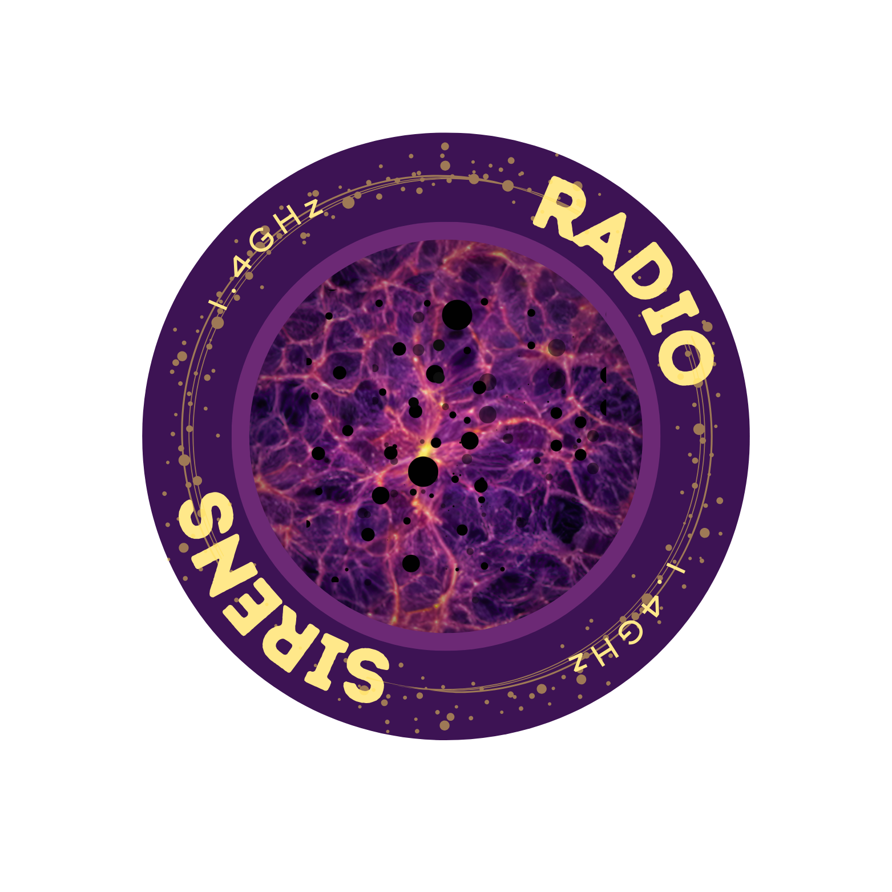

# Radio Sirens

  

Repository with scripts to generate mock BBH and HI intensity-mapping data, run the radio-siren cosmological analyses using the icarogw-HI branch, and reproduce all figures in the corresponding paper. It supports simulations, inference, validation tests, and plotting for the ET–SKA synergy study for H0 inference.
