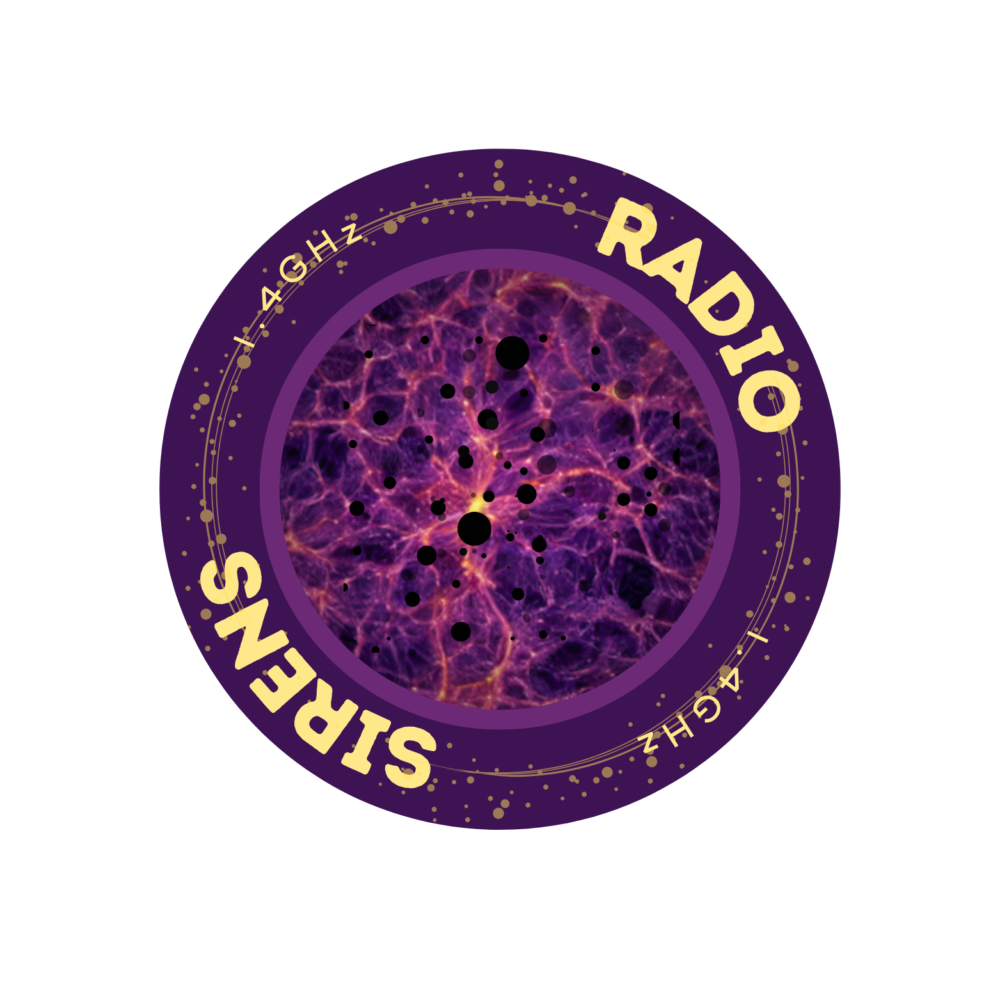

# Radio Sirens

  

Repository with scripts to generate mock BBH and HI intensity-mapping data, run the radio-siren cosmological analyses using the icarogw-HI branch ([link](https://github.com/icarogw-developers/icarogw/tree/HI)), and reproduce all the figures in the corresponding paper ([link](https://arxiv.org/abs/2605.12606)). It supports simulations, inference, validation tests, and plotting for the ET–SKA synergy study for H0 inference.

The starting and output dataset of this repository is released on Zenodo:

The Zenodo record provides a summary and overview of the scripts with the instructions to reproduce the paper's results.

The following repository is also link to Zenodo through:

